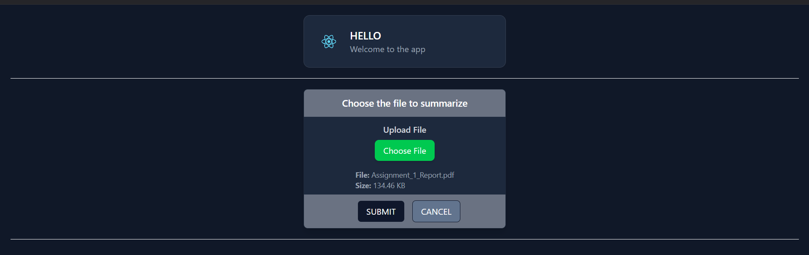
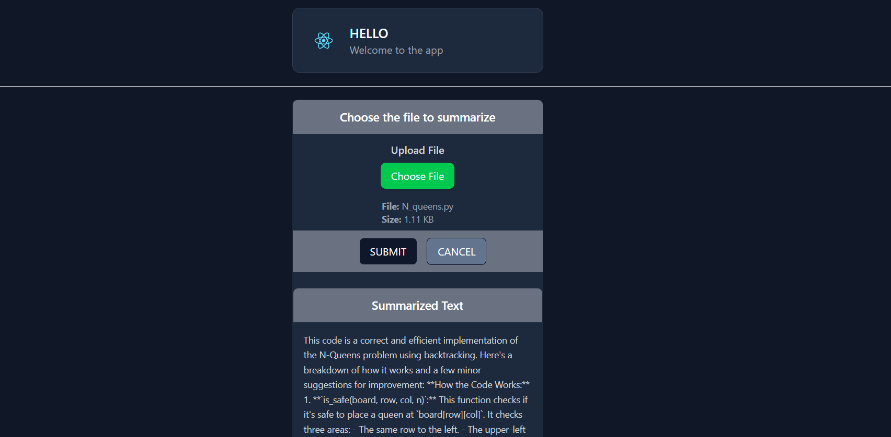

# AI Text Summarizer

This project is a React-based AI-powered text summarizer. It utilizes a Flask backend to process and summarize files uploaded by users.

## Project Setup

This project was bootstrapped with [Create React App](https://github.com/facebook/create-react-app).

### Installation

1. Clone the repository.
2. Navigate to the project folder in your terminal.
3. Run `npm install` to install the necessary dependencies.

## Available Scripts

In the project directory, you can run:

### `npm run dev`

Runs the app in development mode.\
Open [http://localhost:3000](http://localhost:3000) to view it in your browser.

Backend will wun at localhost:5000

---

## Future Scope

- **Own LLM (Large Language Model)**: Implementing a custom-trained model for more personalized and accurate summaries.
- **Download Summary Feature**: A feature that will allow users to download the summarized text as a file.

---

## Technology Stack

- **Frontend**: React.js
- **Backend**: Flask (Python)
- **AI**: Gemini(1.5) API

---

## Getting Started with the App

1. **Upload File**: Upload a file (e.g., text, PDF, etc.) to be summarized.
2. **Get Summary**: The app sends the file to the Flask backend, where it uses AI to generate a summary.
3. **Download Summary**: You will be able to download the summarized text as a file in the future.

---

## Future Improvements

- Add support for more file types.
- Improve the summary generation with more advanced AI models.

---

  

---

  

---
